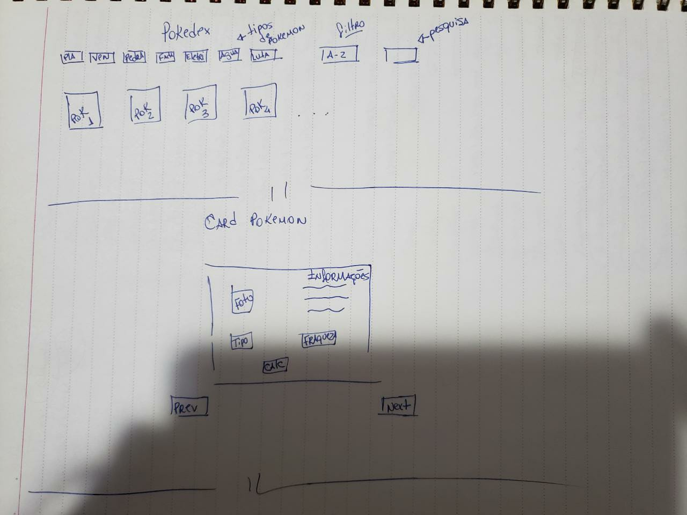
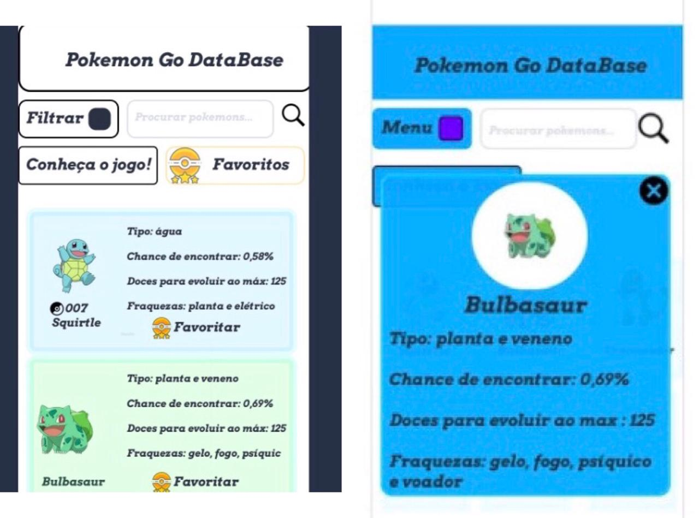

# Data Lovers - Pokémon Go Database

## Índice

1. Projeto Pokémon Go Database
2. Interatividade
3. Personas
4. Protótipo de baixa fidelidade
5. Teste de usabilidade
6. Considerações finais

## 1.Pokémon Go Database

Pokémon GO é um jogo de realidade aumentada voltado para smartphones. 
Com o uso do sistema de posicionamento global (GPS) e a câmera de dispositivos compatíveis, o jogo permite aos jogadores capturar, batalhar, e treinar criaturas virtuais chamadas Pokémon, as quais aparecem nas telas de dispositivos como se fossem no mundo real.
Neste projeto usamos referências do mundo pokémon tanto para o usuário que já conhece o jogo, quanto para os que querem conhecer.

## 2.Interatividade

O usuário poderá:

- Entender o que é o jogo Pokémon Go ao clicar em “Conheça o jogo!” no menu da aplicação.

- Consultar os cards dos pokémons e descobrir a altura, peso, chance de aparecer, fraquezas e evoluções de cada pokémon.

- Ordenar os pokémons por tipo ou por ordem alfabética, clicando nos botões que estão no menu.

- Consultar o pokémon pelo nome usando o campo de pesquisa.

## 3.Personas

A pesquisa com o usuário foi fundamental para entendermos  e aplicarmos  as funcionalidades do projeto. O resultado da pesquisa foram algumas sugestões que o usuário gostaria de ver no site, foram elas:

- Chances do pokémon aparecer.
- Tipos de cada pokémon.
- Fraquezas de cada pokémon.
- Informações como peso, altura e doces.

## 4.Protótipo de baixa fidelidade

Fizemos dois modelos de protótipo da interface, um feito com lápis e papel e outro em formato digital. Conforme feita a pesquisa percebemos que algumas das funções não eram necessárias ou eram dispensáveis.

Link do protótipo digital: https://marvelapp.com/4f76160

## 5.Teste de usabilidade

Com o teste de usabilidade obtivemos feedbacks para melhoria do nosso projeto, como por exemplo o tamanho dos nossos cards e o botão de menu que ficaria mais intuitivo separadamente, como fizemos no formato final. 
Com relação as outras partes do projeto tivemos respostas positivas, tanto a escolha das cores, o conteúdo dos cards dos pokémons e também por ser de fácil usabilidade.

## 6.Considerações finais

Esse projeto foi desenvolvido por Evellyn Thamires e Ully Lopes como parte do bootcamp da Laboratória.

Nesse projeto utilizamos HTML, CSS, Vanilla Javascript e testes unitários com JEST.